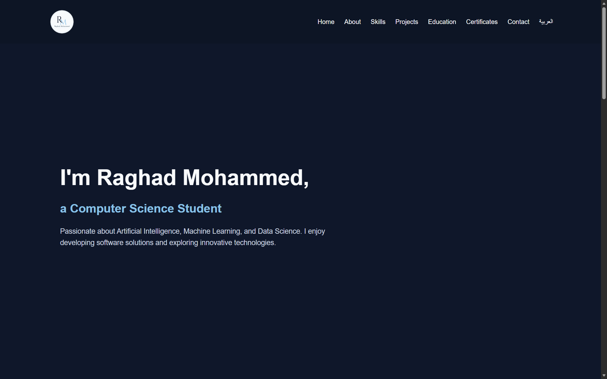
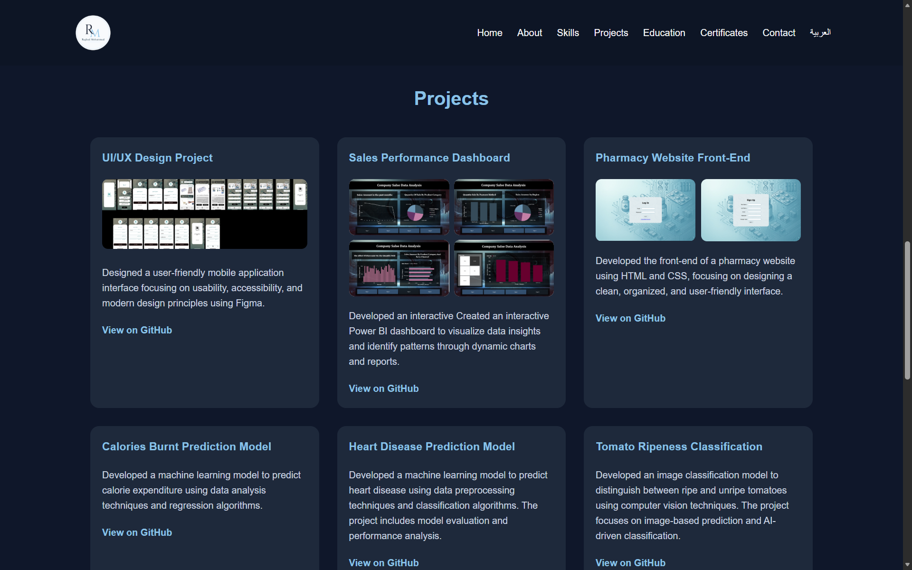

# Raghad Portfolio

A personal portfolio website showcasing my projects, skills, education, and certifications as a Computer Science student interested in Artificial Intelligence, Machine Learning, Data Science, and Web Development.

## Overview

This website serves as my personal portfolio, presenting selected projects along with my skills, educational background, and professional certifications. It was designed to provide a simple, responsive, and organized way to explore my work.

The website is organized into separate sections connected through a sticky navigation bar for smooth navigation. It includes both English and Arabic versions, with each version adapted to its language while maintaining a consistent layout and design. The website was developed using HTML5 and CSS3. Flexbox and CSS Grid were used to organize page elements and create layouts that adapt to different screen sizes, while CSS variables were used to manage colors easily and maintain a consistent design throughout the website.

## Technologies

- HTML5
- CSS3
- Flexbox & CSS Grid
- CSS Variables
- Google Fonts
- Git & GitHub

## Website Preview

A brief look at some sections of the website:

### Home Section

### Projects Section

